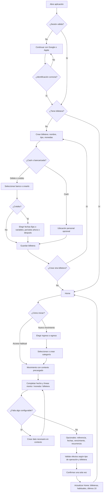

# FLUJO-000 — Recorrido funcional completo: primer uso, Home y movimientos

**Proyecto:** Finanzas personales (JS Backend)  
**Estado:** Especificación funcional consolidada de la simulación; incluye variantes extrapoladas identificadas como tales  
**Versión:** 0.2  
**Fecha:** 2026-09-19  
**Documentos de detalle:** [FLUJO-001 — Primer uso](FLUJO-001-primer-uso.md) · [FLUJO-002 — Home](FLUJO-002-home.md) · [FLUJO-003 — Nuevo movimiento](FLUJO-003-nuevo-movimiento.md)

> Alcance: experiencia funcional y reglas observables, no pantallas definitivas, clases, endpoints, esquema de persistencia ni asignación a las capas de backend/frontend. Los nombres y los importes de los ejemplos son datos **de una simulación**; no prueban que se haya registrado nada en un sistema externo.

## 1. Objetivo y principio de diseño

Permitir que una persona comience a utilizar la aplicación y registre hechos financieros con **el menor número de interacciones compatibles con la información necesaria**. Pedir primero lo indispensable; ofrecer configuración nueva **en el propio punto de selección**, independientemente de que esta requiera uno o varios pasos. Al terminar, regresar al formulario original con todo lo ya ingresado y el nuevo elemento seleccionado. Nunca obligar a completar todas las configuraciones al inicio.

El flujo corto es una **ruta del flujo completo**, no otra operación ni otro sistema de registro. Los valores inferidos o precargados son editables y no inventan ingresos cobrados, cuotas pagadas, saldos disponibles o fechas desconocidas.

### Tres dimensiones temporales que no se deben confundir

| Perspectiva | Egreso | Ingreso |
|---|---|---|
| Hecho económico | Cuándo gasté y cuánto | Cuándo gané y cuánto |
| Obligación/derecho | Cuándo debería pagar y cuánto | Cuándo debería cobrar y cuánto |
| Movimiento efectivo | Cuándo pagué, cuánto y desde dónde | Cuándo cobré, cuánto y dónde entró |

Un mismo hecho puede tener múltiples vencimientos y múltiples pagos/cobros; un pago/cobro puede cancelar varias obligaciones. Fecha económica, fecha de vencimiento y fecha efectiva pueden diferir. Una **proyección** no equivale a un hecho ya ocurrido, ni cambia por sí sola el saldo disponible. La clasificación visible de entrada/salida no implica que toda entrada sea ingreso económico ni que toda salida sea gasto económico: préstamo recibido y devolución de su capital son los primeros contraejemplos.

## 2. Contexto compartido y vocabulario de UX

- **Usuario:** persona identificada con una cuenta ya existente de Google o Apple; no se le exige crear una contraseña específica en el primer uso.
- **Familia:** Ingreso o Egreso; primer selector de «Nuevo movimiento».
- **Categoría:** etiqueta configurable bajo una familia, por ejemplo Sueldo, Comisión, Impuestos, Préstamo. No es por sí sola una regla contable; una categoría «Préstamo» puede requerir precisar la operación concreta.
- **Concepto:** identificación legible de la operación, p. ej. «Impuesto municipal».
- **Referencia reutilizable:** cuenta, cliente, contrato, inmueble, servicio o préstamo al que pertenece una operación; nombre legible y número/referencia opcional. La categoría puede tener múltiples referencias.
- **Moneda:** una o más por billetera y por operación; no se agregan importes de monedas distintas sin una conversión explícita.
- **Billetera:** contenedor financiero identificado por nombre, tipo y monedas admitidas. Una persona puede tener varias de cada tipo y varias en el mismo banco.
- **Tipos iniciales:** cash/efectivo (ubicación personal opcional, sin banco), débito (banco obligatorio, salida/entrada inmediata cuando corresponde), crédito (banco obligatorio, financia y genera obligaciones; no es destino ordinario de sueldo).
- **Línea de movimiento:** importe + moneda + billetera. Una operación puede tener varias líneas, incluso varias en la misma moneda hacia billeteras diferentes.
- **Recurrencia:** patrón configurable para proyectar hechos/vencimientos futuros. No depende de que la categoría sea «Sueldo» ni implica cobro/pago efectivo automático.

## 3. Primer uso: desde la apertura hasta Home

### 3.1. Identificación

1. Abrir aplicación sin sesión → mostrar «Continuar con Google» y/o «Continuar con Apple», según disponibilidad del dispositivo; permitir elegir proveedor.
2. Identificación correcta → recuperar perfil existente o crear perfil nuevo; comprobar si ya tiene una billetera utilizable.
3. Con billetera válida → ir a Home, **sin rehacer onboarding**. Sin billeteras → abrir «Crear primera billetera».
4. Identificación cancelada/fallida → conservar el acceso, permitir reintentar/cambiar proveedor; no mostrar un registro exitoso falso.

### 3.2. Crear billetera, sin catálogo previo obligatorio

Datos comunes: **nombre, tipo, una o más monedas admitidas**. La moneda sugerida por defecto es modificable. El usuario puede agregar una moneda no disponible en el selector y regresar con ella seleccionada.

| Tipo | Datos adicionales | Comportamiento del alta |
|---|---|---|
| Cash | Referencia/ubicación personal opcional («Casa», «Colchón»); banco no aplica. | Tras nombre, tipo y monedas puede finalizar directamente. No asumir saldo inicial cero. |
| Débito | Banco obligatorio. | Selector de bancos existentes con «Agregar banco»: pedir nombre, crear, seleccionar y retomar billetera. |
| Crédito | Banco obligatorio; comportamiento de facturación; configuración de períodos y condiciones que se conozcan. | La facturación puede quedar pendiente si el usuario aún no conoce las fechas. Crear tarjeta sin inventar cierres ni vencimientos. |

**Banco** es entidad reutilizable, no la billetera misma. Se pueden crear varias billeteras con el mismo banco, incluso del mismo tipo y moneda. «Agregar banco» debe estar disponible dentro del selector aun cuando no exista ninguno; al crearlo, queda seleccionado sin perder el formulario.

### 3.3. Particularidades del alta de crédito

- Preguntar explícitamente **«¿Las fechas de cierre y vencimiento son fijas o pueden cambiar entre períodos?»**.
- **Fijas:** permitir definir el patrón habitual para estimar fechas futuras, conservando la posibilidad de corregir períodos concretos.
- **Variables:** cada período de facturación tiene sus propias fechas de apertura, cierre y vencimiento; no copiar las del período anterior como hechos confirmados.
- Permitir **«Configurar períodos más adelante»**: la tarjeta queda creada y se pueden registrar compras, pero la aplicación no atribuirá vencimientos exactos desconocidos. Si se propone una estimación, debe figurar como tal.
- Los períodos, límites, costos, comisiones e intereses pueden requerir un flujo de configuración específico; no solicitarlos en toda alta si no son indispensables para la acción actual.
- El cierre determina a qué resumen corresponde una compra; el vencimiento corresponde al resumen, no equivale a la fecha de compra ni a la fecha en que realmente se paga.

### 3.4. Final de **cada** alta durante el primer uso

Mostrar billetera creada y ofrecer **«Ir a Home»** o **«Crear otra billetera»**. El segundo botón repite el alta sin exigir nuevo registro de identidad. El primero termina onboarding con una o más billeteras; no exige crear categorías, movimientos, saldos iniciales ni todos los períodos de crédito.

**Camino probado:** Google → BBVA Master, crédito, banco BBVA, monedas ARS y USD, facturación diferida → «Crear otra billetera» → EFT, cash, ARS, ubicación Casa → «Ir a Home». Más adelante, durante un sueldo, se creó USD EFT, cash, USD, ubicación Colchón. «Débito» y modo de fechas «fijas» son variantes inferidas de las mismas reglas, no recorridos ejecutados durante la simulación.

## 4. Home

### 4.1. Primera llegada, sin movimientos

Mostrar billeteras existentes con nombre, tipo, entidad/ubicación cuando corresponda, monedas y estado financiero que realmente se conozca. Una tarjeta de crédito no muestra «dinero en cuenta»; puede indicar que su facturación está pendiente. Una billetera sin saldo inicial informado **no debe mostrar saldo disponible 0 ni saldo confiable calculado como si partiera de cero**.

**No mostrar categorías ficticias como «movimientos habituales» en un Home sin historial.** Mostrar estado vacío y **«Nuevo movimiento»**. También permitir **«Agregar billetera»** desde Home.

### 4.2. Home después de registrar operaciones

1. **Billeteras:** todas las disponibles, separadas por identidad y por moneda; abrir detalle y agregar otra.
2. **Movimientos habituales:** accesos solo a categorías/operaciones realmente configuradas o utilizadas. Pulsarlos inicia el mismo formulario de registro con familia/categoría preseleccionadas y sugerencias **editables**. No obligar a usar la misma billetera en cada repetición de una categoría. Personalización/fijado y criterio de frecuencia siguen abiertos.
3. **Nuevo movimiento:** siempre disponible; empieza desde Ingreso/Egreso, sin imponer una categoría previa.
4. **Últimos movimientos:** hasta 10 operaciones reales recientes; mostrar concepto/categoría, importe(s) y moneda(s), fecha relevante y billetera(s). Un sueldo con dos líneas de cobro es un único hecho económico, una compra en tres cuotas no son tres gastos distintos. Abrir detalle y ofrecer «Ver todos». Precisar qué evento y qué fecha determinan el orden exacto sigue pendiente.
5. **Proyecciones:** pueden mostrarse aparte con etiqueta «Previsto/proyectado». Nunca mezclarlas con cobros o pagos realizados.

**Camino probado:** tras el primer impuesto aparece el acceso «Impuestos», no otros accesos precargados; tras el sueldo aparece también «Sueldo». El impuesto de $14.999 y el sueldo de 1.700 ARS + 1.200 USD conservan cada uno su identidad. La variación registrada de EFT tras impuesto, sueldo y devolución de préstamo es 1.700 − 14.999 − 500 = **−13.799 ARS**, pero **no es su saldo disponible**, ya que no se conoce el saldo inicial. USD EFT tiene una entrada registrada de 1.200 USD; tampoco presupone saldo inicial cero.

## 5. Nuevo movimiento: camino completo, corto y extensible

### 5.1. Acceso y categoría

1. Home → «Nuevo movimiento» → elegir **Ingreso / Egreso**.
2. Mostrar categorías existentes de esa familia; si no hay, estado vacío y **«Crear categoría»**. Desde cualquier selector, ofrecer **«Agregar/Crear»** independientemente del largo del alta.
3. Crear categoría requiere como mínimo **nombre + familia** (familia actual precargada); volver con categoría seleccionada y datos anteriores preservados.
4. Si llegó por acceso habitual, omitir los selectores ya resueltos; si necesita modificarlos, ofrecer esa posibilidad.
5. Seleccionar la categoría no responde por sí solo qué sucedió financieramente: cuando importe, preguntar el subtipo de operación (ejemplo Préstamo → otorgué / devolví / intereses y gastos).

### 5.2. Datos mínimos y opciones progresivas

- Para un cobro/pago ya realizado: **una o más líneas «importe positivo · moneda · billetera compatible»**. El formulario muestra la moneda predeterminada y/o la última billetera útil como sugerencia editables. Fecha efectiva predeterminada: hoy; posibilidad de editar fecha y de registrar fechas distintas por línea cuando corresponda.
- **Concepto** identificable, si no está determinado por el acceso elegido; **referencia reutilizable opcional** a cuenta/cliente/inmueble/contrato/préstamo, con selector y creación contextual. Para «Impuestos → Impuesto municipal» podrían existir cuentas Dpto 0027 y Casa. La referencia tiene nombre y número externo opcional; puede añadirse o corregirse posteriormente sin duplicar el gasto.
- **Período o fecha económica, vencimientos, detalle de intereses/comisiones, recurrencia:** disponibles cuando correspondan; no meter pasos obligatorios si el registro básico no los requiere. No confundir un valor omitido con una fecha confirmada. Si el usuario ya sabe que el ingreso/gasto se generó en un período distinto al cobro/pago, debe poder consignarlo.
- **Moneda:** una línea por combinación necesaria de importe, moneda y destino/origen; una operación puede tener múltiples monedas. No convertir ni totalizar monedas distintas sin cotización y regla explícitas.
- **Billetera:** selector filtrado por tipo y monedas compatibles y por la operación; sueldo recibido no ofrece tarjeta de crédito como destino ordinario. Crear billetera ausente desde ese selector, incluso creando banco o moneda a su vez; volver al mismo movimiento con todos los importes y líneas conservados.
- **Recurrencia opcional:** permitir frecuencia semanal, quincenal, mensual, bimestral, anual o personalizada según el hecho. «Sueldo» clasifica trabajo realizado, no impone periodicidad mensual. Repetición proyecta importes/fechas esperadas, **no acredita ni debita dinero automáticamente**. Una proyección posterior requiere confirmación de lo real antes de declararse cobrada/pagada.

### 5.3. Efecto según instrumento

| Caso | Hecho económico | Obligación/derecho | Movimiento efectivo |
|---|---|---|---|
| Servicio/impuesto pagado en cash | Gasto cuando ocurrió | Puede estar ya satisfecho | Sale dinero del efectivo al pagarlo |
| Servicio/impuesto pagado con débito | Gasto cuando ocurrió | Puede estar ya satisfecho | Sale dinero de la cuenta al pagarlo |
| Compra con crédito | Gasto cuando ocurrió | Deuda y cuotas/resumen futuros | **No** sale dinero del banco al comprar; solo al pagar efectivamente la tarjeta |
| Sueldo recibido en varias billeteras | Ingreso ganado una vez por los importes/monedas pertinentes | Puede quedar algo por cobrar | Cada línea suma a su destino en su fecha de cobro |
| Préstamo recibido | No tratar capital como ingreso económico por el hecho de ingresar dinero | Deuda por devolver | Entrada efectiva en billetera al recibirlo |
| Devolución de principal de préstamo | No crear un segundo gasto económico por el principal | Reduce deuda | Salida efectiva desde billetera utilizada |
| Intereses/comisiones de préstamo | Pueden ser gasto económico separado | Pueden ser parte del compromiso de cuota | Salen cuando realmente se pagan |

**Sin movimiento efectivo no debe inventarse salida/entrada.** Un pago de resumen de crédito no recrea las compras que contiene. La falta de período de crédito limita proyecciones, pero no debe alterar el gasto registrado. La compra y su financiación siguen vinculadas.

## 6. Caso probado: primer movimiento, impuesto municipal

**Situación:** primera llegada a Home con BBVA Master (crédito, ARS/USD) y EFT (cash, ARS); no hay categorías ni historial.

1. Nuevo movimiento → Egreso → crear categoría **Impuestos** → concepto **Impuesto municipal**.
2. Introducir **14.999 ARS**, seleccionar **EFT**, fecha económica y de pago: día del registro (en la simulación, 19/09/2026).
3. Opcionalmente identificar **cuenta/cliente de referencia**. En la prueba se añadió **después** de registrar: nombre **Dpto 0027**, referencia **xxxxx00027**. El flujo definitivo debe ofrecerla **antes de confirmar** y admitir edición posterior.
4. Recurrencia: **no configurada**; no crear obligaciones futuras a partir de esa omisión.
5. Confirmar → único egreso/gasto por 14.999 ARS y única salida efectiva de 14.999 ARS de EFT; movimiento visible en Home y acceso habitual «Impuestos» disponible.

**Variantes extrapoladas:** con otra billetera cash o débito, cambia únicamente el origen de la salida; con tarjeta de crédito, registrar gasto y obligación futura, pero no marcar salida bancaria efectuada ni resumen pagado. Una misma categoría puede corresponder a muchas referencias, y una referencia puede tener muchas facturas históricas.

## 7. Caso probado: sueldo con dos monedas y creación de billetera contextual

1. Nuevo movimiento → Ingreso → no hay categorías de ingresos → crear **Sueldo**.
2. Cargar primera línea: **1.700 ARS → EFT**.
3. Cargar segunda línea: **1.200 USD**. No existe billetera de destino USD compatible: desde el selector, crear **USD EFT**, tipo cash, USD, ubicación «Colchón».
4. Regresar al sueldo **sin perder primera línea ni el importe de la segunda**; USD EFT queda seleccionado como destino de la segunda.
5. Opcionales informados: fecha de cobro **07/09/2026**, período ganado **agosto**, recurrencia **mensual**.
6. Confirmar → **un ingreso salarial** con importes en dos monedas y **dos cobros** asociados en billeteras distintas. No totalizar 1.700 ARS + 1.200 USD como si fueran una misma moneda. La próxima ocurrencia es **proyectada**, no dinero cobrado ni saldo disponible.

**Variantes extrapoladas:** más líneas, misma moneda en varias billeteras, cobro parcial, fechas de cobro diferentes, sueldo ganado en un mes y cobrado varios meses después, recurrencia no mensual, ingreso sin cobro aún. Para un ingreso únicamente ganado y pendiente, permitir registrar hecho y derecho de cobro sin inventar una billetera destinataria ni exigir una fecha efectiva de cobro. El formulario corto «monto · moneda · billetera» corresponde al caso **ya cobrado**; no debe bloquear el caso pendiente.

## 8. Caso probado: devolución parcial y proyección de préstamo

### 8.1. Identificar el préstamo dentro del egreso

1. Nuevo movimiento → Egreso → categoría **Préstamo** (creable si falta) → seleccionar **Devolví un préstamo**. El subtipo es indispensable para distinguir otorgamiento, devolución de principal y pago de costos.
2. No existe préstamo asociado → «Agregar préstamo» → acreedor **Fiat**, nombre/referencia **Fiat Argo** → volver al egreso, con ese préstamo seleccionado. El préstamo puede crearse con datos mínimos, sin exigir conocer todo su plan en ese momento.
3. Registrar **500 ARS**, billetera **EFT**, fecha efectiva **19/09/2026**, **0** intereses y **0** comisiones. Confirmar que es **devolución parcial**.
4. Registrar la salida efectiva de 500 ARS y reducir el capital conocido por ese pago **sin crear gasto económico por ese principal**. Como no se conocía el préstamo original, el saldo total queda **por determinar**, no cero.

### 8.2. Completar capital después del pago

5. Desde el detalle del préstamo, permitir «Completar datos». Alternativas: **capital original + principal ya devuelto con anterioridad** o **saldo actual expresamente confirmado**, indicando si este incluye o no el pago que acabamos de registrar.
6. Datos probados: original **17.999 ARS**, fecha de origen **01/08/2026**, principal previamente devuelto **0 ARS**, pago ya registrado **500 ARS** → capital pendiente calculado **17.499 ARS**. Mantener fecha económica/origen y fecha efectiva de devolución diferentes.

### 8.3. Configurar obligaciones futuras sin duplicar pagos

7. Seleccionar plan: cuotas fijas, variables, pagos libres o calendario específico. Camino probado: **cuotas de importe fijo**.
8. Datos probados: **18** cuotas originales de **11.000 ARS**, **2** declaradas completamente pagadas, próximo vencimiento pendiente **05/10/2026**, frecuencia **mensual**.
9. Proyección inicial: **16 vencimientos restantes × 11.000 ARS = 176.000 ARS**, cuotas 3 a 18, de **05/10/2026** a **05/01/2028** si la periodicidad mensual se mantiene. Son compromisos **previstos**, nunca pagos efectivos.
10. **No duplicar** el pago conocido de 500 ARS ni inventar cobros/egresos históricos de las dos cuotas declaradas pagadas. La declaración «dos cuotas pagadas» y la evidencia efectiva de un solo pago de 500 ARS no permiten reconstruir sus movimientos anteriores.
11. Queda sin resolver **a qué cuota se aplica el pago de 500 ARS**: parcial de cuota abierta, adicional a cuotas completas, o contenido en una cuota que se terminó de pagar con otros movimientos aún no cargados. Registrar la asignación explícita o dejarla pendiente; no atribuirla silenciosamente a una cuota.
12. **Inconsistencia de importes:** 17.999 ARS de principal original frente a 18 cuotas de 11.000 ARS (198.000 ARS nominales). Además, 17.499 ARS de principal restante difieren de 176.000 ARS de cuotas futuras. No atribuir la diferencia a intereses o comisiones sin desglose documentado; pedir conciliación o conservar el plan como **proyección no conciliada**. El plan puede ser real aun si los datos de principal ingresados son incompletos o erróneos.

**Variantes extrapoladas:** pago parcial de una cuota, mora, pagos libres, cambio de importe/vencimiento, pago con varias billeteras, gastos e intereses por separado, préstamo emitido por banco u otra persona; cada variante respeta hecho económico, obligación y movimiento efectivo.

## 9. Configuración contextual anidada y navegación

El selector de cualquier elemento configurable ofrece «Agregar». Ejemplos: categoría dentro de movimiento; moneda dentro de línea; billetera dentro de cobro/pago; banco dentro de billetera; referencia dentro de factura; préstamo dentro de devolución. Cada alta tiene sus propios mínimos. Al completarla, regresar exactamente al contexto padre con el elemento recién creado seleccionado. Si se cancela, volver sin inventar un elemento y manteniendo los datos anteriores. Si se interrumpe, recuperar el borrador cuando sea posible.

**Regla de validación:** no aceptar un pago/cobro ya realizado sin monto positivo, moneda válida y billetera compatible; sí admitir una obligación sin pagar/un derecho sin cobrar sin exigir billetera de movimiento efectivo. No habilitar crédito como billetera de destino habitual de un sueldo. No exigir banco para cash; sí exigirlo para débito/crédito. No asumir que la billetera tiene fondos suficientes si no se conoce su saldo inicial.

## 10. Diagrama de recorrido

## 11. Matriz de aceptación y cobertura

| ID | Escenario y verificación | Cobertura |
|---|---|---|
| AC-01 | Identificarse con Google y no exigir contraseña nueva; reutilizar sesión existente | Probado en simulación para Google; Apple por analogía |
| AC-02 | Crear cash sin banco y con ubicación personal opcional | Probado: EFT y USD EFT |
| AC-03 | Crear crédito con banco nuevo, varias monedas y períodos diferidos | Probado: BBVA Master; fechas variables/fijas por extensión acordada |
| AC-04 | Tras crear billetera, «Ir a Home» o «Crear otra billetera» | Probado |
| AC-05 | Home inicialmente sin operaciones ficticias ni habituales antes de registrar | Probado/corregido |
| AC-06 | Nueva categoría de egreso creada en registro y seleccionada | Probado: Impuestos |
| AC-07 | Impuesto cash: gasto y pago únicos; referencia opcional editable posteriormente | Probado: 14.999 ARS, Dpto 0027 |
| AC-08 | Categoría habitual surge tras un registro real; nuevo movimiento sigue visible | Probado: Impuestos y Sueldo |
| AC-09 | Sueldo de dos monedas en una operación, dos billeteras, sin conversión implícita | Probado |
| AC-10 | Crear billetera USD desde sueldo y regresar conservando ambas líneas | Probado: USD EFT |
| AC-11 | Sueldo ganado en agosto, cobrado en septiembre, recurrencia mensual proyectada sin acreditación automática | Probado |
| AC-12 | Recurrencia de frecuencia no mensual y fechas de cobro por línea | Inferido de regla funcional; pendiente prueba específica |
| AC-13 | Crear referencia, banco, moneda, préstamo desde su selector y regresar sin pérdida | Referencia, banco y préstamo probados; moneda por analogía |
| AC-14 | Devolución de 500 ARS: salida EFT, disminución de deuda, sin gasto nuevo de principal | Probado |
| AC-15 | Préstamo sin saldo conocido permite registrar pago y completar capital después | Probado |
| AC-16 | Plan de 18 cuotas, 2 declaradas pagadas, 16 previstas y ninguna salida efectiva inventada | Probado; atribución de 500 a cuota pendiente |
| AC-17 | Compra con tarjeta genera gasto/obligación, no salida inmediata; cierres variables admitidos | Regla acordada, sin recorrido completo probado |
| AC-18 | Home lista hasta 10 operaciones reales, una sola entrada lógica para el sueldo multimoneda | Acordado; unidad/orden detallados pendientes |
| AC-19 | Débito exige banco y cash no; varias billeteras pueden compartir entidad | Regla acordada; no recorrido de débito en simulación |
| AC-20 | Ingreso ganado pero aún sin cobrar se puede registrar sin billetera ficticia | Extensión necesaria del modelo temporal; pendiente prueba específica |

## 12. Decisiones abiertas: no inventar comportamiento para implementarlas

1. **Saldos iniciales:** cómo y cuándo se informa saldo inicial de cash/débito, y cómo se presenta la variación registrada sin confundirla con disponible.
2. **Crédito:** calendario y apertura/cierre/vencimiento reales, cambios por período, límites multimoneda, comisiones, financiación de resumen, pagos parciales, compras en cuotas y su asignación precisa a períodos.
3. **Préstamos:** conciliación de principal, intereses y plan nominal; reglas de imputación de pagos parciales a cuotas; cómo registrar pagos históricos declarados sin inventar movimientos bancarios.
4. **Ingresos aún no cobrados:** UX mínima para registrar generado/por cobrar sin billetera, y cómo ligar cobros parciales posteriores.
5. **Recurrencias:** fecha base, días no hábiles, cambios en importe, fin/cancelación y conversión de proyección en operación real.
6. **Referencias:** si una cuenta/cliente se comparte entre categorías o se restringe por tipo de servicio; atributos específicos opcionales.
7. **Home:** criterio exacto de «movimiento» y fecha de orden para los últimos 10; contenido detallado de tarjetas de billetera; elección de accesos habituales (categoría, operación específica o ambos).
8. **Multimoneda:** conversiones, cotizaciones y transferencias entre billeteras en monedas diferentes; no presuponerlas en los ejemplos.

**Regla para los agentes:** implementar lo explícitamente acordado; las variantes inferidas deben conservar las invariantes anteriores. Los puntos abiertos requieren una decisión funcional independiente, no una suposición técnica oculta.
