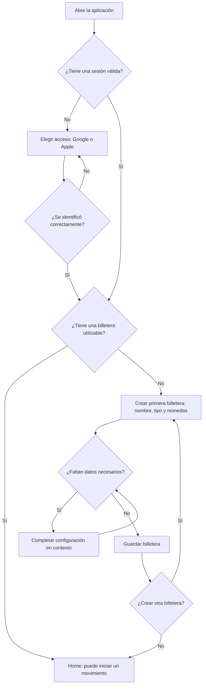

# FLUJO-001 — Primer uso: identificación y primera billetera

**Proyecto:** Aplicación de finanzas personales  
**Estado:** Flujo validado en simulación y ampliado con creación contextual de banco y facturación  
**Versión:** 0.2  
**Fecha de documentación:** 2026-09-19  
**Alcance:** Desde la primera apertura de la aplicación hasta la llegada a Home en condiciones de registrar un movimiento.  
**Fuera de alcance:** Diseño de pantallas definitivo; contratos de API; modelo de datos; asignación de responsabilidades a las capas de backend/frontend.

## 1. Objetivo

Permitir que una persona comience a usar la aplicación con el menor número de pasos: (1) identificarse con una cuenta que ya usa y (2) configurar al menos una billetera. Después debe poder llegar a Home y registrar movimientos sin completar por anticipado un catálogo de categorías, todas sus billeteras ni otras configuraciones no indispensables.

**Principio de diseño:** El camino habitual debe ser el más corto posible. Cuando falta una configuración necesaria para completar una operación, la aplicación permite realizarla en contexto y retomar el punto anterior, preservando los datos ya ingresados.

## 2. Condiciones de inicio y resultado

- **Disparador:** Una persona abre la aplicación por primera vez o ingresa con una cuenta sin configuración inicial completa.
- **Precondiciones:** La aplicación puede presentar un mecanismo de identificación con Google o Apple. No se asume la existencia previa de billeteras ni categorías.
- **Resultado exitoso:** La persona queda identificada, tiene al menos una billetera utilizable con nombre, tipo y una o más monedas admitidas, y accede a Home.
- **Resultado interrumpido:** Si abandona el proceso antes de completar la primera billetera, no se considera terminado el primer uso. Al volver, debe retomar la configuración pendiente, sin obligarla a crear otra identidad.

## 3. Flujo principal

| Paso | Acción de la persona | Comportamiento esperado de la aplicación |
|---|---|---|
| 1 | Abre la aplicación. | Si no hay sesión activa, presenta el acceso con la cuenta existente. |
| 2 | Elige continuar con Google o Apple, según disponibilidad y preferencia. | Inicia el proceso de identificación del proveedor elegido. No solicita crear una contraseña propia para la aplicación en este flujo. |
| 3 | Completa la identificación. | Reconoce una cuenta existente o crea el perfil de usuario en el primer acceso. Comprueba si ya tiene una billetera configurada. |
| 4 | Si todavía no tiene billeteras, inicia «Crear primera billetera». | Presenta la configuración mínima: **nombre**, **tipo** y **moneda(s) admitida(s)**. Puede proponer valores iniciales editables. |
| 5 | Completa los datos y confirma. | Valida la información; si es suficiente para utilizar la billetera seleccionada, la crea y la deja disponible. |
| 6 | Continúa. | Abre Home. La persona ya puede iniciar el registro de un ingreso o egreso. |

**Regla de navegación:** Si la persona ya tiene una billetera válida, no se le pide crear otra en cada inicio; accede a Home. Si se identificó pero todavía no configuró ninguna, retoma la creación de la primera billetera.

## 4. Configuración de la primera billetera

### Datos comunes mínimos

| Dato | Requisito | Criterio funcional |
|---|---|---|
| Nombre | Obligatorio | Nombre reconocible por la persona; se puede proponer uno por defecto, pero debe poder editarlo. |
| Tipo | Obligatorio | Al menos: **cash/efectivo**, **débito/cuenta de disponibilidad inmediata** y **crédito**. Cada tipo tiene reglas de operación propias. |
| Monedas admitidas | Obligatorio | Una o más monedas seleccionables. La moneda predeterminada se propone si está disponible y puede cambiarse. No se asume ARS para todas las personas ni una única moneda por billetera. |

Los datos anteriores representan la **base común**. Una billetera puede requerir datos adicionales según el tipo para quedar operativa. Por ejemplo, el crédito tiene períodos y condiciones de financiación; **qué datos son obligatorios en el alta y cuáles pueden diferirse queda pendiente de definición**. La aplicación no debe declarar una billetera lista si faltan datos efectivamente necesarios para ejecutar la operación que el usuario pretende realizar.

### Si falta información o configuración

- Si una moneda deseada no está disponible, permitir incorporarla o habilitarla en contexto, y volver a la creación de la billetera.
- Si el tipo de billetera requiere información adicional indispensable para funcionar, solicitarla en ese mismo proceso; no enviar a la persona a una configuración desconectada.
- Si la persona vuelve atrás o cancela la creación, conservar la identidad ya establecida y no marcar el primer uso como finalizado.
- No exigir en este paso categorías de ingreso/egreso ni configurar otras billeteras que no sean necesarias.

## 5. Home inmediatamente después del primer uso

Home debe permitir **iniciar un nuevo movimiento** sin una nueva etapa de configuración general. Puede mostrar el estado inicial de las billeteras y la ausencia de movimientos, pero la composición exacta de Home se diseñará por separado.

Si al registrar el primer movimiento falta una categoría o una billetera adicional, el flujo de registro permitirá crearla **en contexto** y volver al movimiento preservando lo ingresado. La primera billetera no obliga a que todas las operaciones futuras utilicen esa billetera.

## 6. Casos alternativos y excepciones funcionales

1. **Cuenta ya existente con configuración completa:** identificar y abrir Home; omitir el alta de billetera.
2. **Cuenta existente sin billeteras:** identificar y presentar «Crear primera billetera»; no solicitar un segundo registro.
3. **Identificación cancelada o fallida:** mantener la persona en el acceso y permitir reintentar o cambiar de proveedor, sin afirmar que se creó su cuenta.
4. **Billetera incompleta o datos inválidos:** indicar únicamente los campos pendientes o inválidos y permitir corregirlos sin reiniciar el proceso.
5. **Necesidad de varias billeteras o monedas:** el primer uso exige al menos una billetera; las demás pueden crearse luego, incluso durante el registro de una operación.

## 7. Reglas funcionales acordadas

- **FU-001:** La identificación se realiza, en el flujo inicial, mediante una cuenta existente del usuario (Google o Apple), evitando un registro manual con contraseña propia.
- **FU-002:** Una persona no debe estar obligada a cargar categorías, recurrencias o varias billeteras antes de acceder a Home.
- **FU-003:** El primer uso queda completo cuando la persona está identificada y tiene al menos una billetera utilizable.
- **FU-004:** Cada billetera tiene nombre, tipo y una o más monedas admitidas. Puede haber múltiples billeteras del mismo tipo, moneda y entidad.
- **FU-005:** Los valores sugeridos son editables. No se presupone una moneda única ni un proveedor de identidad único.
- **FU-006:** Si falta una configuración necesaria, el usuario puede resolverla en el flujo actual y continuar desde el punto interrumpido.
- **FU-007:** La existencia de una billetera no implica que ya existan movimientos o que su saldo inicial deba suponerse igual a cero: el tratamiento de saldos iniciales es una decisión posterior.

## 8. Diagrama textual

## 8 bis. Ampliaciones validadas durante la simulación

- Cash admite **ubicación o referencia personal opcional** y no requiere banco. Débito y crédito requieren **seleccionar un banco**. Si no existe, se crea en el propio selector mediante su nombre y se regresa con el banco seleccionado. El mismo banco puede tener numerosas billeteras distintas.
- Al crear una billetera de crédito, solicitar explícitamente si sus fechas de cierre y vencimiento son **fijas o variables por período**. En modo variable se guardan/confirmarán fechas particulares de apertura, cierre y vencimiento de cada período; no se presume repetición mensual. Puede diferirse la configuración de períodos sin inventar vencimientos exactos.
- Tras crear **cada** billetera en onboarding, ofrecer «**Ir a Home**» y «**Crear otra billetera**». El usuario puede repetir las altas; no debe estar obligado a registrar una segunda billetera.
- Recorrido probado: Google → BBVA Master (crédito, banco BBVA, ARS y USD, períodos diferidos) → crear otra → EFT (cash, ARS, Casa) → Home. Una tercera billetera USD EFT (cash, USD, Colchón) se creó después, dentro de un movimiento, sin pérdida del borrador.
- Véase el [recorrido funcional consolidado](FLUJO-000-recorrido-completo.md) para invariantes financieras y las variantes asumidas.

## 9. Decisiones pendientes (no bloquear el flujo conceptual)

- Disponibilidad exacta de Google/Apple por plataforma y reglas para vincular dos proveedores a una misma identidad.
- Política de nombre sugerido y moneda predeterminada en una instalación nueva.
- Detalle adicional por tipo de billetera: configuración contractual del crédito, apertura/cierre/vencimiento por período, costos y condiciones. Banco obligatorio en débito/crédito y modo fijo/variable ya acordados.
- Cómo se registra o confirma un saldo inicial de efectivo o débito; no inventar automáticamente dinero disponible.
- Diseño definitivo de Home y del acceso directo a «Nuevo movimiento».
- Política para editar monedas admitidas en una billetera ya utilizada.

## 10. Criterios de aceptación del flujo inicial

- Una persona nueva puede identificarse, crear una billetera y llegar a Home sin crear categorías ni registrar un movimiento.
- Una persona que ya tiene billetera llega a Home sin pasar nuevamente por la configuración inicial.
- Es posible crear la primera billetera con más de una moneda admitida.
- Si faltan datos para crear una billetera, pueden completarse sin perder los datos ya ingresados.
- Una persona que interrumpe la configuración puede retomarla sin tener que repetir el alta de identidad.
- Desde Home se puede iniciar el registro de un movimiento; cualquier categoría o billetera adicional que falte se podrá crear en el propio flujo de registro.

---

**Nota de alcance:** Este documento especifica el **primer uso**. La carga de un sueldo con líneas monto–moneda–billetera, la distinción entre ingreso ganado y cobro efectivo, la creación de categorías en contexto y la recurrencia configurable pertenecen al flujo de registro de movimientos, que se documentará de forma separada.
