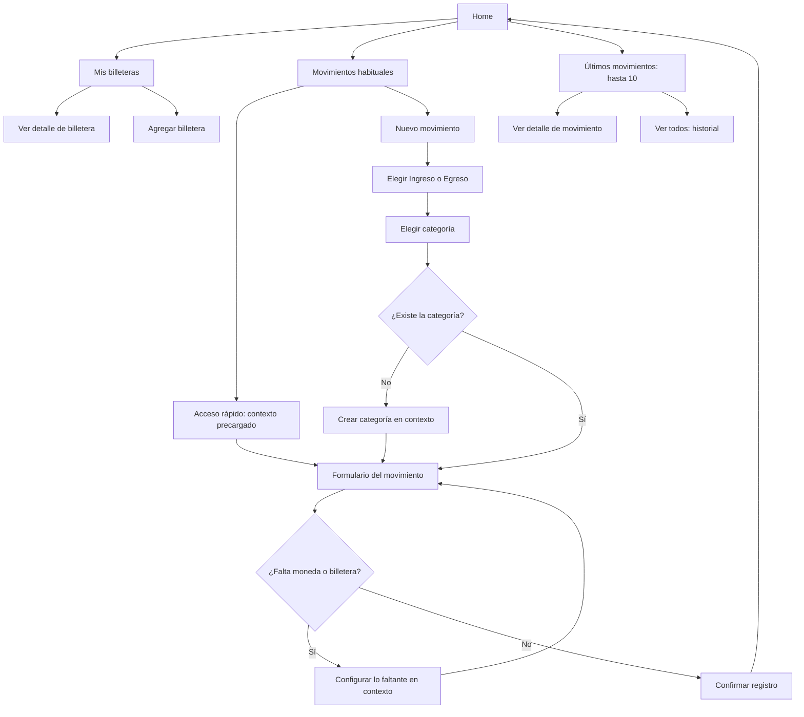

# FLUJO-002 — Home: billeteras, accesos rápidos y últimos movimientos

**Proyecto:** Aplicación de finanzas personales  
**Estado:** Borrador funcional; estructura general acordada, detalles identificados como pendientes  
**Versión:** 0.2  
**Fecha de documentación:** 2026-09-19  
**Relación:** Continúa [FLUJO-001 — Primer uso](FLUJO-001-primer-uso.md).  
**Alcance:** Pantalla de inicio tras la identificación y la configuración de al menos una billetera; acceso al registro de movimientos y al historial.  
**Fuera de alcance:** Diseño visual definitivo; modelo de datos; contratos de API; distribución entre capas; implementación de cálculos de saldos o de crédito.

## 1. Objetivo

Desde Home, la persona debe poder **ver sus billeteras**, **registrar un ingreso o egreso habitual con el mínimo de pasos**, **iniciar un movimiento nuevo desde el principio** y **consultar los últimos 10 movimientos**.

**Principio de experiencia:** Home reduce pasos cuando conoce el contexto de una operación, pero mantiene siempre disponible el registro completo. Si falta una categoría, moneda o billetera, debe permitir configurarla sin descartar los datos ya ingresados.

## 2. Condiciones de entrada

- La persona está identificada y dispone de al menos una billetera utilizable, según FLUJO-001.
- Puede no tener categorías creadas ni movimientos registrados: esto **no impide** acceder a Home ni iniciar el primer movimiento.
- Puede tener múltiples billeteras del mismo tipo y/o entidad, y billeteras que admiten varias monedas.
- Los datos de ejemplo que siguen son ilustrativos: Home no debe inventar saldos, consumos, límites ni movimientos.

## 3. Estructura funcional de Home

El orden acordado de los bloques es:

1. **Mis billeteras:** mostrar las billeteras disponibles y dar acceso a agregar otra.
2. **Movimientos habituales:** accesos directos a conceptos utilizados con frecuencia; botón permanente **Nuevo movimiento**.
3. **Últimos movimientos:** listado de hasta 10 movimientos recientes y acceso **Ver todos**.

### 3.1. Mis billeteras

- Mostrar todas las billeteras configuradas; identificar cada una por **nombre** y **tipo** (cash/efectivo, débito, crédito u otros que se definan).
- Diferenciar billeteras aunque compartan banco, tipo o moneda.
- Identificar las monedas admitidas y mostrar los importes pertinentes a cada moneda **sin sumar monedas distintas en un total arbitrario**.
- La información mostrada debe ser **adecuada al tipo**: para efectivo o débito puede existir un saldo de fondos; para crédito, los conceptos de disponibilidad, consumos, deuda o límite son distintos y requieren reglas específicas aún por definir.
- Permitir entrar al detalle de una billetera y agregar una nueva desde Home. El detalle específico queda para otro flujo.
- **Pendiente:** cómo establecer y mostrar saldos iniciales, saldos por moneda, importes pendientes y disponibilidad de tarjetas de crédito. No asumir saldo cero solo por falta de movimientos.

### 3.2. Movimientos habituales

- Mostrar botones para iniciar operaciones comunes, por ejemplo **Servicios, Comida, Sueldo, Comisiones e Impuestos**. Los nombres exactos dependen de las categorías u operaciones configuradas, no de un catálogo fijo obligatorio.
- Al pulsar un acceso rápido, abrir el **mismo flujo de registro** que se usa para un movimiento nuevo, con el contexto ya conocido precargado; no solicitar de nuevo familia y categoría si el acceso ya las determina.
- Para cada línea de cobro o pago se puede necesitar **monto, moneda y billetera**, como se analizó en el flujo de ingreso. Las características particulares del egreso y del crédito se validarán en sus propios casos.
- Utilizar valores predeterminados **editables**, cuando existan y sean apropiados. No fijar una billetera única para una categoría: el usuario puede pagar Servicios con distintas cuentas, tarjetas o efectivo.
- Mantener visible **Nuevo movimiento** incluso si el usuario dispone de accesos rápidos.

**Origen de accesos:** **no mostrar movimientos habituales ficticios ni categorías sugeridas como si ya estuvieran configuradas durante el primer uso**. Los accesos aparecen a partir de categorías/operaciones efectivamente creadas o utilizadas (probado: Impuestos tras el primer egreso, Sueldo tras el primer ingreso). Priorización por frecuencia o fijado manual siguen pendientes de validación.

**Decisión pendiente:** un botón podría representar (a) una **categoría** general —p. ej., «Servicios»—, (b) una **operación habitual** concreta —p. ej., «Luz» con valores sugeridos—, o (c) ambas cosas. No se debe tratar esta opción como una decisión ya tomada.

### 3.3. Últimos movimientos

- Mostrar **hasta 10** movimientos registrados, ordenados del más reciente al más antiguo.
- Para cada movimiento, mostrar como mínimo su **categoría o concepto**, **importe y moneda**, **fecha** e información identificadora de la(s) **billetera(s) asociada(s)** cuando corresponda. La presentación de movimientos con varias monedas o billeteras requiere una representación que preserve cada importe, sin conversiones implícitas.
- Diferenciar visualmente las entradas y las salidas, sin sustituir por ello su tratamiento financiero.
- Pulsar un movimiento abre su detalle; **Ver todos** lleva al historial completo. El diseño del detalle y del historial queda fuera de este flujo.
- Si hay menos de 10 movimientos, mostrar los existentes. Si no hay ninguno, presentar un estado vacío con la acción para registrar el primero.

**Criterio de agrupación:** una compra financiada en tres cuotas no aparece como tres gastos nuevos; un sueldo cobrado en varias billeteras tampoco debe duplicar el ingreso económico. La definición exacta de qué cuenta como una fila de «últimos movimientos» —hecho económico original, cobro/pago efectivo o ambos con distinta identificación— queda **pendiente** de validar. El listado debe evitar que una obligación futura o un movimiento de dinero se presente falsamente como otro gasto/ingreso económico.

## 4. Flujos de navegación

### 4.1. Camino corto: acceso habitual

| Paso | Acción de la persona | Respuesta de la aplicación |
|---|---|---|
| 1 | En Home pulsa «Luz», «Sueldo» u otro acceso habitual. | Abre el formulario de movimiento con familia/categoría (o referencia a operación habitual, si se define) precargadas. |
| 2 | Revisa o introduce los datos que falten, p. ej. monto, moneda y billetera. | Propone valores conocidos editables; no obliga a confirmar pasos ya resueltos. |
| 3 | Confirma el registro. | Registra la operación válida y vuelve al contexto apropiado; Home puede reflejarla en los últimos movimientos. |

**Si falta configuración:** desde el campo correspondiente se crea la categoría, moneda o billetera necesaria; al terminar, la nueva opción queda seleccionada y se retoma el registro con los datos conservados.

### 4.2. Camino completo: nuevo movimiento

| Paso | Acción de la persona | Respuesta de la aplicación |
|---|---|---|
| 1 | En Home pulsa **Nuevo movimiento**. | Inicia el flujo desde la elección de **Ingreso / Egreso**, sin asumir una categoría. |
| 2 | Elige la familia. | Muestra las categorías existentes para esa familia y la opción **Crear categoría**. |
| 3 | Selecciona o crea una categoría. | Abre el registro de la operación con esa categoría. |
| 4 | Completa los datos exigidos por la operación y la billetera utilizada. | Ofrece valores editables y configuración en contexto si falta algo. |
| 5 | Confirma. | Registra la operación y permite encontrarla en el historial/Home. |

**Crear categoría en contexto:** solicitar inicialmente **nombre** y **familia (ingreso/egreso)**, tomando esta última del camino actual; guardar y regresar a la operación con la nueva categoría seleccionada. No exigir un catálogo de categorías durante el primer uso.

### 4.3. Consulta rápida del historial

Home → sección **Últimos movimientos** → pulsar una fila para su detalle **o** pulsar **Ver todos** para acceder al historial completo.

## 5. Reglas funcionales de Home

| ID | Regla |
|---|---|
| HOME-001 | Mostrar las billeteras disponibles del usuario, distinguiendo entidades, tipos y monedas cuando corresponda. |
| HOME-002 | Presentar la información financiera de cada billetera según su morfología; no tratar la disponibilidad de crédito como saldo de efectivo. |
| HOME-003 | Permitir iniciar la creación de una billetera adicional desde Home. |
| HOME-004 | Presentar accesos directos a movimientos habituales; su mecanismo de selección/personalización es configurable y queda por validar. |
| HOME-005 | Un acceso rápido evita repetir la selección de familia y categoría cuando esa información ya está determinada. |
| HOME-006 | Los valores sugeridos de importe, moneda o billetera pueden modificarse antes de registrar. |
| HOME-007 | **Nuevo movimiento** siempre inicia el flujo completo desde la selección Ingreso/Egreso. |
| HOME-008 | Toda configuración necesaria que falte puede resolverse en contexto, sin perder los datos del registro en curso. |
| HOME-009 | Mostrar hasta 10 movimientos registrados, comenzando por el más reciente. |
| HOME-010 | Cada entrada del listado identifica concepto/categoría, importe(s), moneda(s), fecha y billetera(s) relevantes. |
| HOME-011 | Distinguir visualmente los ingresos de los egresos sin equiparar automáticamente «movimiento de dinero» y «hecho económico». |
| HOME-012 | Permitir abrir el detalle de un movimiento desde su fila. |
| HOME-013 | Incluir **Ver todos** para navegar al historial completo. |
| HOME-014 | Con menos de 10 movimientos, mostrar únicamente los existentes. |
| HOME-015 | Sin movimientos, mostrar un estado vacío desde el que se pueda registrar el primero. |

## 6. Diagrama de navegación

## 7. Criterios de aceptación

- Tras FLUJO-001, Home muestra la(s) billetera(s) creada(s) aun cuando no haya categorías ni movimientos; la sección de habituales no presenta accesos a categorías inexistentes.
- El usuario puede iniciar un movimiento mediante **Nuevo movimiento**, elegir Ingreso/Egreso y crear su primera categoría sin salir del registro.
- El usuario puede abrir un acceso habitual e ir directamente al formulario con el contexto conocido, conservando la posibilidad de cambiar la billetera.
- Durante el registro, una categoría o billetera faltante puede crearse y seleccionarse sin reiniciar el movimiento.
- El usuario puede visualizar varias billeteras incluso si son del mismo banco o tipo, sin fusionarlas.
- Home muestra como máximo 10 movimientos; **Ver todos** da acceso al historial completo.
- Con cero movimientos, Home presenta un estado vacío útil y no muestra operaciones ficticias.
- Una compra en cuotas no se presenta como varios gastos nuevos en el listado; un ingreso distribuido entre varias billeteras no se duplica como ingreso económico.

## 8. Decisiones pendientes

1. **Accesos rápidos:** categoría, operación habitual concreta o combinación; orden automático, y accesos fijados. Nunca presentar categorías inexistentes como habituales en la primera visita.
2. **Billeteras:** contenido exacto de cada tarjeta según tipo; saldos iniciales, saldos multimoneda, deuda y disponible de crédito.
3. **Últimos movimientos:** definición de unidad de listado y fecha usada para ordenar cuando difieren fecha económica, vencimiento y pago/cobro; representación de operaciones de múltiples líneas, monedas y billeteras.
4. **Detalle y acciones posteriores:** campos visibles, edición, eliminación/anulación y registro de pagos/cobros asociados.
5. **Registro contextual:** qué campos concretos son mínimos por categoría y medio de pago; los valores precargados no deben inventar hechos económicos ni pagos efectivos.

---

**Nota de alcance:** Este documento define el **Home y sus rutas de acceso**; no especifica todavía los casos de uso financieros, la recurrencia ni la representación contable de cada operación. La información proyectada, las obligaciones pendientes y los movimientos efectivos deben seguir siendo distinguibles cuando se incorporen a la pantalla.

**Integración:** [FLUJO-000 — Recorrido funcional completo](FLUJO-000-recorrido-completo.md) · [FLUJO-003 — Nuevo movimiento](FLUJO-003-nuevo-movimiento.md).
